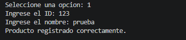
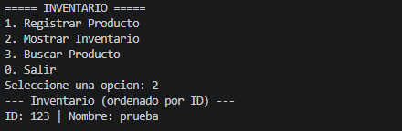
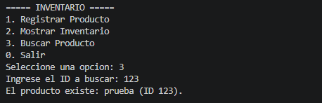
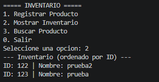

# Inventario con Árbol Binario de Búsqueda

Aplicación de consola en Java que gestiona un inventario de productos usando un **árbol binario de búsqueda (ABB)** ordenado por ID.

**Autor:** Juan David Cuadros
**Materia:** Estructura de datos
**Fecha:** 27/09/2026

---

## Estructura del proyecto

El programa está dividido en tres clases:

| Archivo | Rol | Descripción |
|---|---|---|
| `Producto.java` | El nodo | Guarda `int id` y `String nombre`, y los punteros `Producto izquierdo` y `Producto derecho`. |
| `ArbolInventario.java` | La lógica | Contiene `insertar` (recursivo), `recorridoInorden` y `buscar` (por ID). |
| `Main.java` | La interfaz | Menú interactivo con `switch-case` que usa el árbol. |

## Requisitos

- Java JDK 8 o superior.

## Compilación y ejecución

Coloca los tres archivos en la misma carpeta y ejecuta:

```bash
javac *.java
java Main
```

## Menú de opciones

```
===== INVENTARIO =====
1. Registrar Producto
2. Mostrar Inventario
3. Buscar Producto
0. Salir
```

- **1. Registrar Producto:** solicita ID y nombre, y lo inserta en el árbol.
- **2. Mostrar Inventario:** ejecuta el recorrido inorden y lista los productos ordenados por ID.
- **3. Buscar Producto:** solicita un ID e indica si el producto existe o no.
- **0. Salir:** termina el programa.

## Funcionamiento de los métodos

- **Insertar (recursivo):** compara el ID nuevo con el del nodo actual. Si es menor, baja por el subárbol izquierdo; si es mayor, por el derecho; al llegar a una posición vacía, coloca el nuevo nodo.
- **Recorrido inorden:** visita el subárbol izquierdo, luego el nodo y por último el derecho. En un ABB esto produce la lista ordenada de menor a mayor ID.
- **Buscar:** recorre el árbol comparando el ID buscado, descartando la mitad de los nodos en cada paso, y devuelve el producto o `null` si no existe.

## Decisiones de diseño

- **IDs únicos:** si se intenta registrar un ID que ya existe, el programa lo rechaza y muestra un mensaje, para evitar duplicados en el inventario.
- **Validación de entrada:** si el usuario escribe letras donde se espera un número (opción del menú o ID), el programa muestra un aviso en lugar de cerrarse con error.
- **Inventario vacío:** al mostrar un inventario sin productos, se informa que está vacío.

## Complejidad

| Operación | Caso promedio | Peor caso (árbol degenerado) |
|---|---|---|
| Insertar | O(log n) | O(n) |
| Buscar | O(log n) | O(n) |
| Recorrido inorden | O(n) | O(n) |

## Capturas de pantalla

### 1. Registrar producto


### 2. Mostrar inventario (recorrido inorden)


### 3. Buscar producto (existe)


### 4. Ordenar



## Ejemplo de ejecución

```
Seleccione una opción: 1
Ingrese el ID: 50
Ingrese el nombre: Tornillos
Producto registrado correctamente.

Seleccione una opción: 1
Ingrese el ID: 30
Ingrese el nombre: Martillo
Producto registrado correctamente.

Seleccione una opción: 2
--- Inventario (ordenado por ID) ---
ID: 30 | Nombre: Martillo
ID: 50 | Nombre: Tornillos

Seleccione una opción: 3
Ingrese el ID a buscar: 30
El producto existe: Martillo (ID 30).

Seleccione una opción: 3
Ingrese el ID a buscar: 99
El producto con ID 99 no existe.
```
